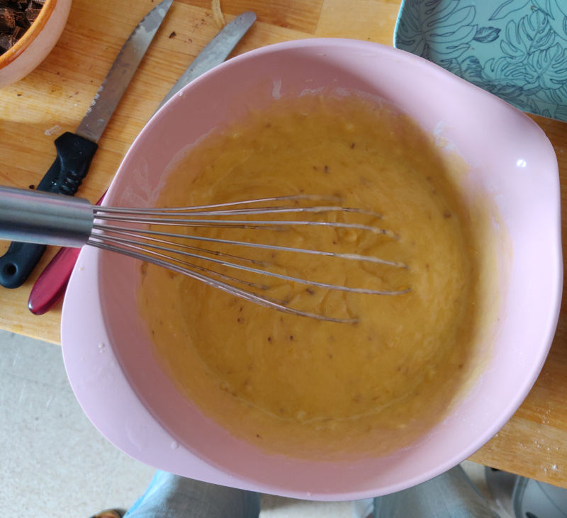
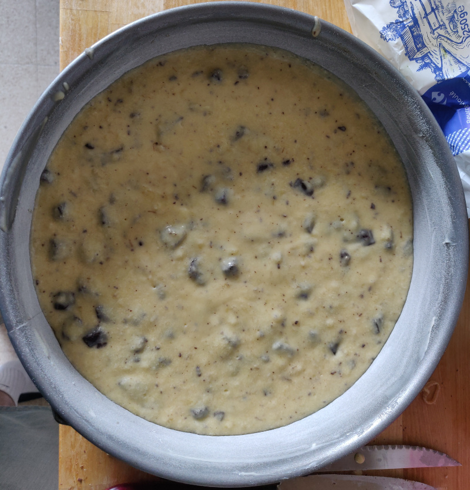
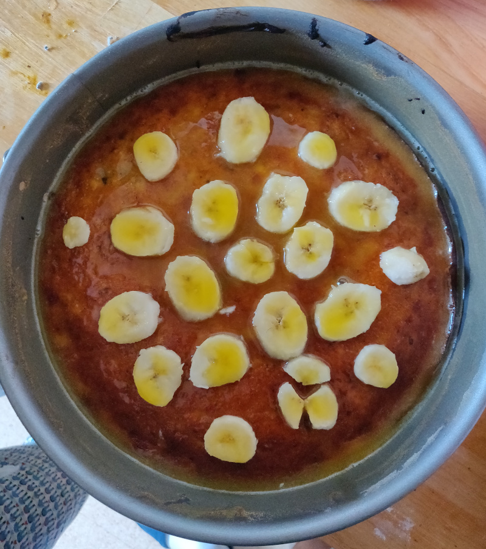
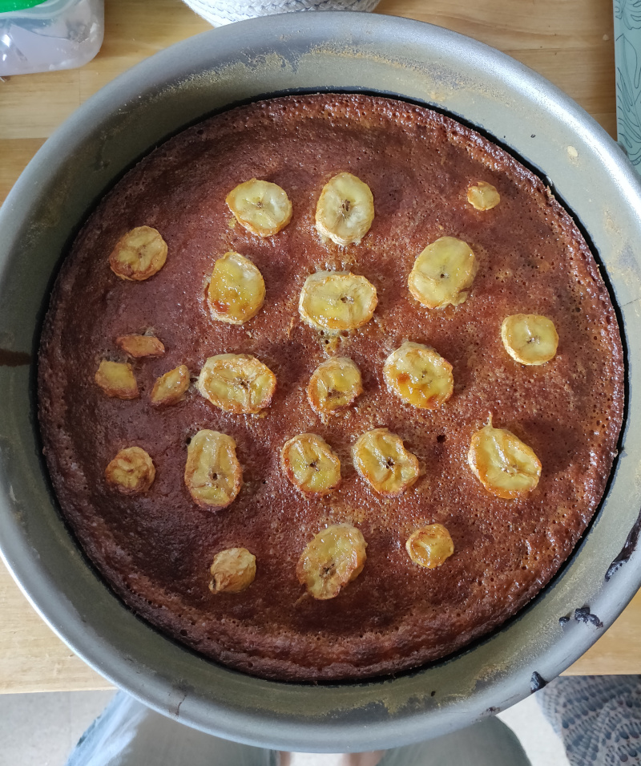

# Banana and Chocolate Cake

## Overview

Main             | Notes
---------------- | ----------
Is it complexe?  | noob level
About the dishes | light
Quick or not     | yes

inspired by [il était une fois la pâtisserie](https://www.youtube.com/watch?v=HaIINUjbCHE)

## Ingredients

### Cake

What?                    | How Many?
------------------------ | -----------
(rip) banana             | 2
lighty salted butter     | 120gr
sugar                    | 80gr
eggs                     | 2
flour (t55)              | 120gr
baking powder            | 1/2 sachet
chocolate (chunks/chips) | 110gr

### Cream/Topping

What?                | How Many?
-------------------- | ---------
lighty salted butter | 60gr
sugar                | 50gr
(rip) banana         | 1
eggs                 | 1

## Recipe's Steps

### Step 1: preheat the oven

* 200°C

### Step 2: about the cake preparation

* melt the butter and in a bowl mix it with the sugar
* add and mash the bananas to the preparation and continue to mix it
* and the eggs and continue to mix the preparation
* add the flour and the baking powder and mix the preparation

* finally add the chocolate chunks and guess what? still mixing the preparation
* when it looks "homogeneous", move the preparation in a baking pan (with a diameter of ~22cm)

* put the baking pan in the oven for almost 15 minutes

### Step 3: about the topping

* melt the butter and in a bowl mix it with the sugar
* add the eggs and continue to mix the preparation
* cut the banana in thin slices and keep it right next

### Step 4: finish it

* once the cake is baked keep it aside and down the oven to 180°C
* spread the banana slices on the top of the cake
* pour the topping preparation on the cake

* put back the baking pan in the oven for 25 minutes

### Step 5: enjoy

## Improvements / Ideas

* it's already perfect :heart_eyes:
