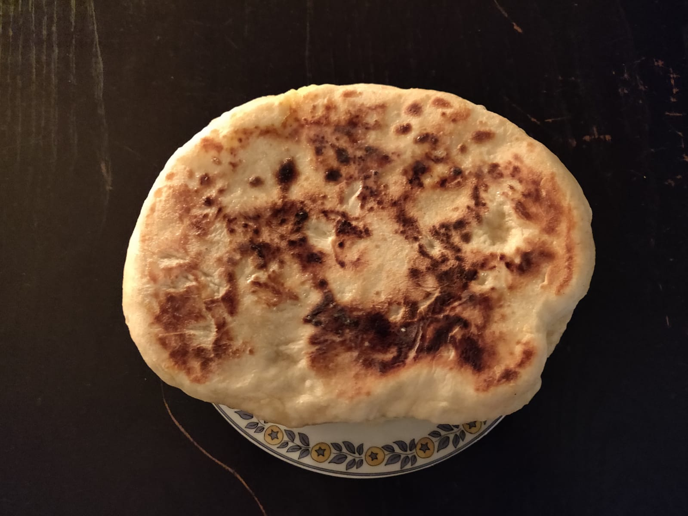

# Cheese Naan

## Overview

Main             | Notes
---------------- | -------------
Is it complexe?  | average level
About the dishes | medium
Quick or not     | not

inspired by [Ma cabane aux delices](https://youtu.be/CM4Qz-Lpnfo)

## Ingredients

5 naans

What?         | How Many?
------------- | --------------
eggs          | 2
yogurts       | 2 (== 250gr)
thick cream   | 1 tablespoon
baking powder | 1/2 sachet
slat          | 9gr
flour (t55)   | 400gr
olive oil     | 1 tablespoon
fetat         | 150gr
comté         | 250gr
butter        | *some* to cook

## Recipe's Steps

### Step 1: prepare the naan dough

* in a large salad bowl mix with a whisk: the yogurts, the thick cream and the baking powder
* once the mix is homogeneous, cover the salad bowl with a towel and wait 15 minutes
* then add one egg and the salt
* and finally add the flour

:information_source: At this final sub step, you can start to mix the dough with a tablespoon but you will probably need
to finish with your hands to obtain an homogeneous/consistent and smooth dough.

* last sub steps: add the olive oil and keep mixing with your hands until the dough is no more sticky
* wrap the dough with a cling film and keep it for 30 minutes
* then divide the dough in 5 balls (use flour if the dough is too sticky)

### Step 2: prepare the cheese mix

* grate the feta and the comté in a big bowl
* add one egg and start to mix
* divide the cheese preparation in 5 little balls

### Step 3: set the naan

This is the tricky part...

* wrap the cheese mix with the naan dough
* with your hands start to slowly and carefully flatten your dough and cheese ball

:warning: it's very important to keep an uniform repartition of the dough around the cheese

* in a hot pan with butter, cook your flattened dough and cheese preparation

### Step 4: enjoy

## Improvements / Ideas

* you can replace the cheese mix by the *Vache Qui Rit*
* easy to keep it in your freezer!
