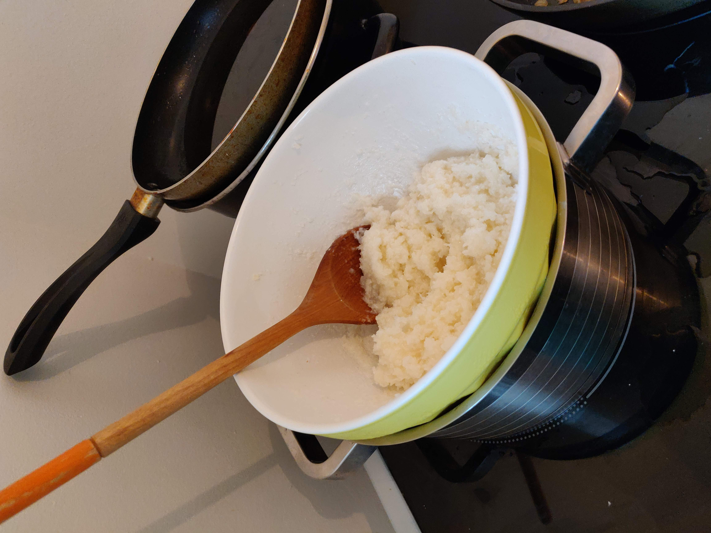
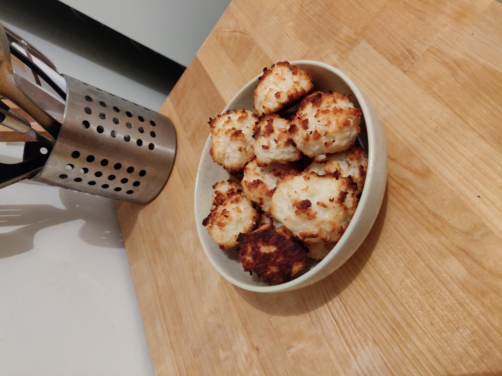

# Coco Rocks

## Overview

Main             | Notes
---------------- | ----------
Is it complexe?  | noob level
About the dishes | light
Quick or not     | yes

inspired by [www.mesinspirationsculinaires.com](https://www.mesinspirationsculinaires.com/article-recette-congolais-rochers-noix-de-coco.html)

## Ingredients

~ 12 coco rocks

What?           | How Many?
--------------- | ---------------
egg whites      | 2
sugar           | 90g
grating coconut | 100g

## Recipe's Steps

### Step 1: preheat the oven

* 220°C

### Step 2: about the preparation

* in a bowl, merge all the ingredients
* cook it for 10 minutes in a bain-marie
* and keep mixing it with a whisk

### Step 3: shape the rocks

* take a small part of the preparation and shape it as a little "ball"
* drop the rocks on a plate with greaseproof paper

### Step 4: finish it

* put them in the oven for almost 7 minutes
* then let them cool off (don't be too hurry ^^)

### Step 5: enjoy

## Improvements / Ideas

* you can drop the coco rocks' bottom in a bowl of melted chocolate (and don't forget to wait to let the chocolat be fixed to the coco rock)
