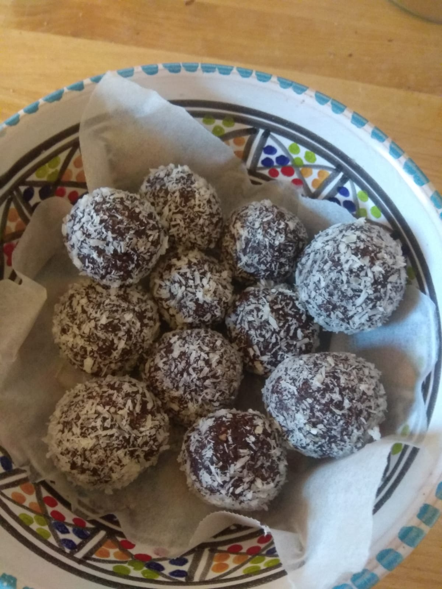

# Date Energy Balls

## Overview

Main             | Notes
---------------- | ----------------
Is it complexe?  | extra noob level
About the dishes | extra light
Quick or not     | yes

inspired by a recipe from Tiff-Tiff

## Ingredients

~ 10 energy "balls"

What?           | How Many?
--------------- | -------------
date            | 100g
flaked almonds  | 60g
grating coconut | 20g
cacao           | 2 tablespoons

## Recipe's Steps

### Step 1: mix it up

* except the gratting coconut, put in your blender every ingredients

* mix it up

### Step 2: shape the "balls"

* take a small part of the preparation and shape it as a little "ball"

### Step 3: finish it

* put the gratting coconut in a bowl
* roll every "balls" in the gratting coconut

## Improvements / Ideas

* you can conserve it for a very long time
* you can add a crunchy part by adding a whole almond in the "ball"
