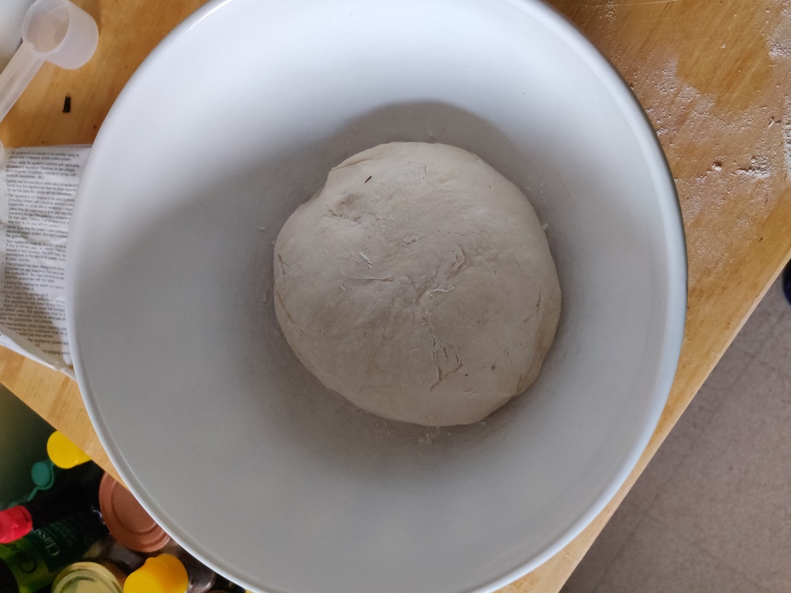
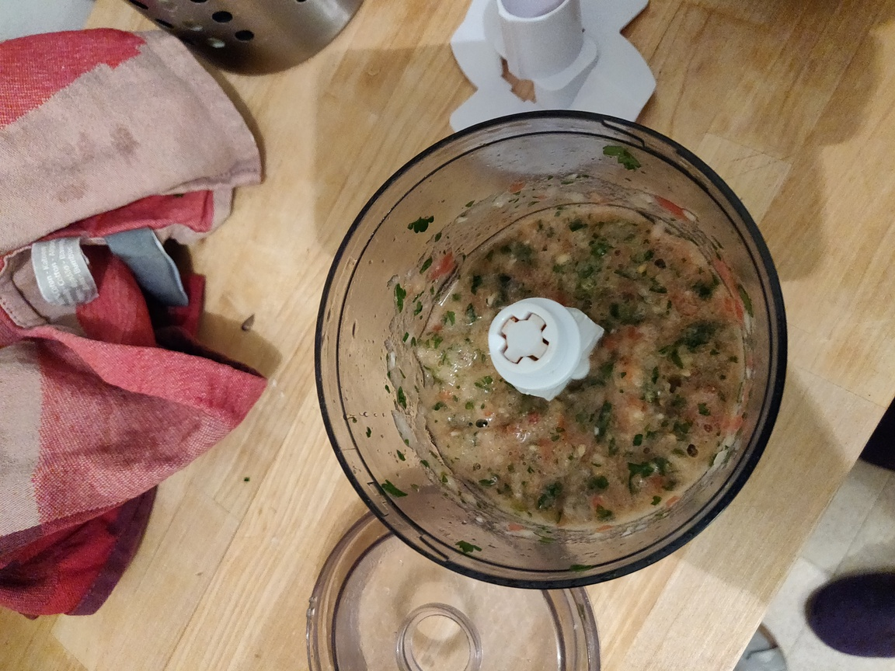
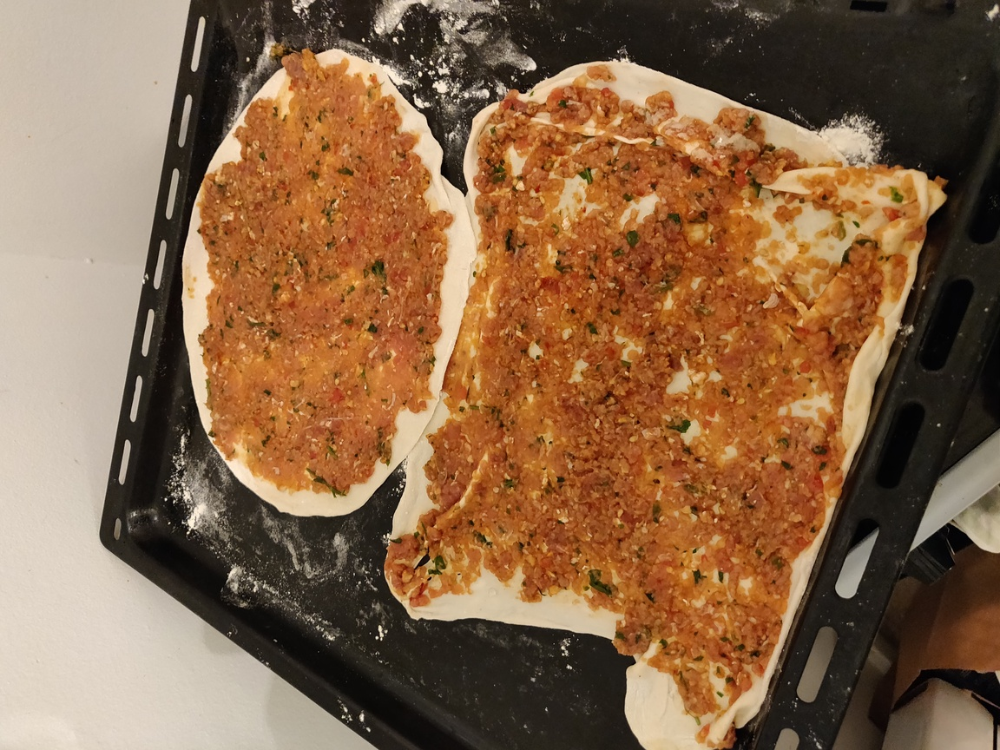
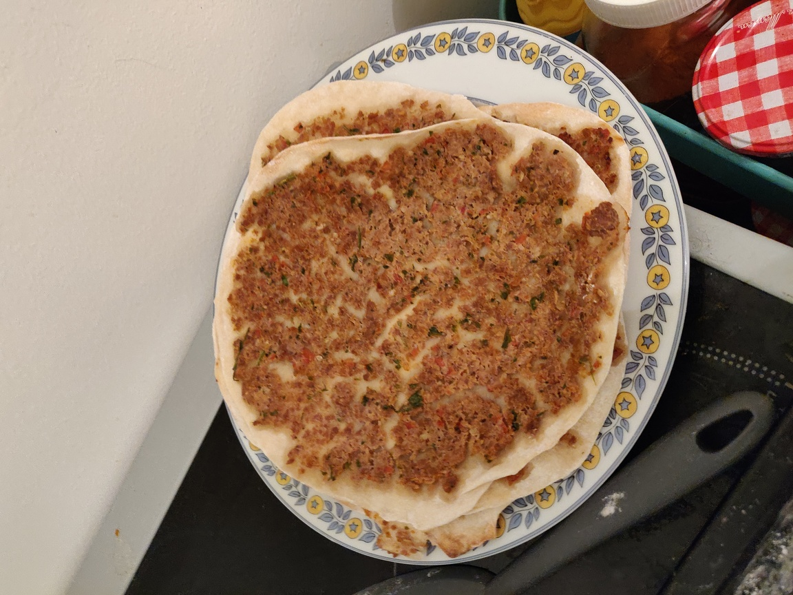

# Lahmacun - "Pizza Turque"

## Overview

Main             | Notes
---------------- | ----------
Is it complexe?  | noob level
About the dishes | light
Quick or not     | yes

inspired by [Food Is Love - Lahmacun](https://youtu.be/E8sj3nSr0Ag)

## Ingredients

~ 10 lahmacuns

### Dough part

What?       | How Many?
------------| -----------
flour (t55) | 400g
water       | 25cl
salt        | 1 teaspoon

### Stuffing part

What?              | How Many?
-------------------| ---------------------
mince beef         | around 300g
onion              | small one
garlic             | 1 clove
parsley            | 1 handful
tomato             | 1
tomato concentrate | 1 big fat tablespoon
harissa            | 1 teaspoon
paprika            | 1 teaspoon
cumin              | 1/2 teaspoon
lemon              | juice from a half
oil                | 3 tablespoons
salt               | 1 teaspoon
pepper             | 1 teaspoon

## Recipe's Steps

### Step 1: prepare the dough

* in bowl just mix the flour, the water and the salt... until you have something
homogenous without any trace of water.
* at the end of your kneading, the dough should not be sticky anymore.

:information_source: If you have a kneading machine it's pretty simple, put
everything in the bowl and wait :D

* on a floury work surface, shape the dough as a big ball and store it in a
floury bowl.
* cover the bowl with a napkin and let the dough rest during the stuffing
preparation.

### Step 2: prepare the stuffing

* in your blender put the onion, the garlic, the parsley and the tomato
* process until you have something which looks like a mash.

* in a bowl with all the other ingredients transfer the mash and just mix!

### Step 3: preheat the oven

* 220°C

### Step 4: create the lahmacun

* split the dough in pieces of ~60-70g (~10 mini balls).
* spread the mini ball (by trying to keep a circle shape) as much as you can, the
dough should not be thick (around 2mm).
* spread the stuffing on it. The stuffing should cover all the dough

* put it in the oven for almost 5-6 minutes (on a floury plate!)

### Step 4: bonus

* enjoy it by wrapping with lahmacun some onion, salad and lemon!
