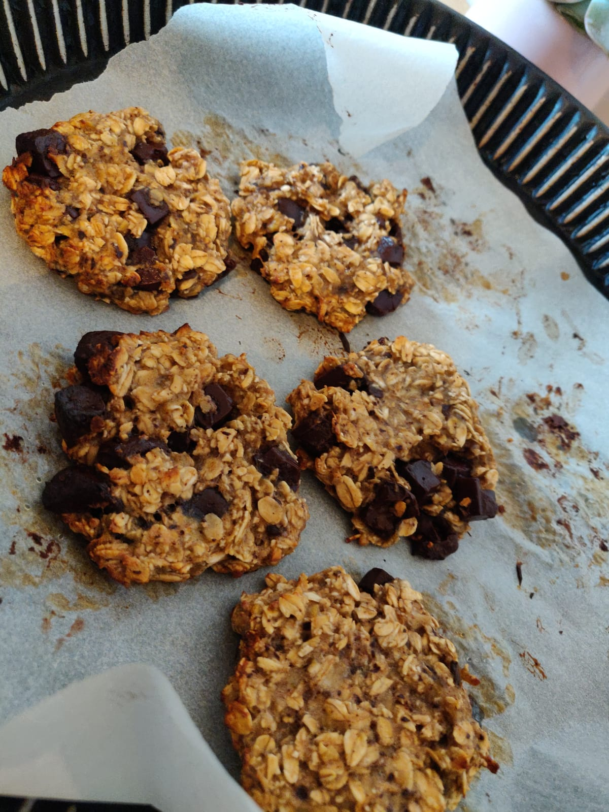

# Vegan Cookies

## Overview

Main             | Notes
---------------- | ----------
Is it complexe?  | noob level
About the dishes | light
Quick or not     | yes

inspired by [lafeestephanie.com](http://www.lafeestephanie.com/2017/04/recette-des-cookies-aux-flocons-davoine.html)

## Ingredients

~ 8 vegan cookies

What?           | How Many?
--------------- | ---------------
banana          | 1
flakes          | 60g
chocolate chips | 40g
cinnamon        | pinch
honey           | 1 tablespoon

## Recipe's Steps

### Step 1: preheat the oven

* 180°C

### Step 2: about the preparation

* in a bowl, mash the banana
* add the cinnamon, the flakes, the chocolate chips and the honey
* mix it up

### Step 3: shape the cookies

* split the preparation in 8 parts
* shape each part as a cookie :)
* drop the cookies on a plate with greaseproof paper

### Step 4: finish it

* put them in the oven for almost 10 minutes
* then let them cool off (don't be too hurry ^^)

### Step 5: enjoy

## Improvements / Ideas

* for real vegan recipe, replace the honey by agaves syrup
