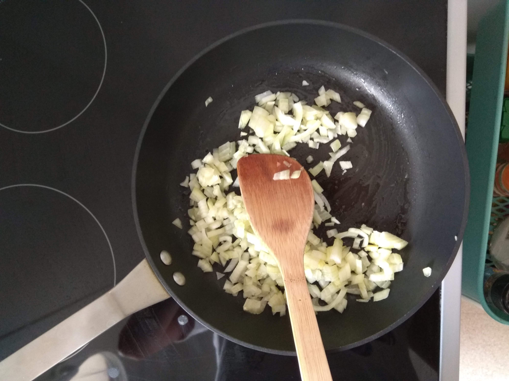
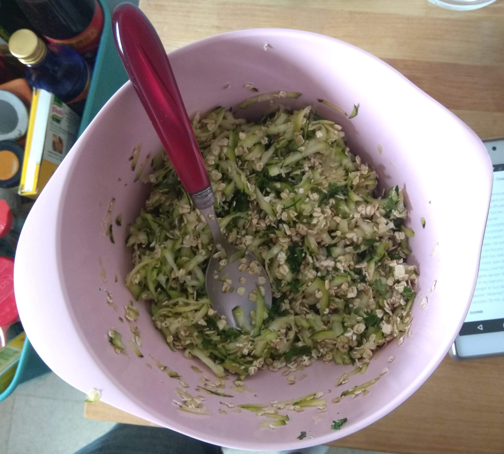

# Veggie Croquettes

## Overview

Main             | Notes
---------------- | ----------
Is it complexe?  | noob level
About the dishes | light
Quick or not     | yes

inspired by [gratinez.fr](http://www.gratinez.fr/cuisine/boulettes-vegetariennes-courgettes-oignons-curry/)

## Ingredients

~ 15 veggie croquettes

What?           | How Many?
--------------- | ---------------
courgette       | 1
onion           | 1 (a fatty one)
flakes          | 80g
grated cheese   | 30g
egg             | 2
minced parsley  | 2 tablespoons
curry           | 2 teaspoons
garlic          | 1
olive oil       | :)
salt and pepper | :)

## Recipe's Steps

### Step 1: about the onion

* peel and mince the onion
* brown the minced onion in an hot pan with the olive oil

### Step 2: first part of the preparation

* wash, grate the courgette
* peel and press the garlic
* merge the courgette, the garlic and the flakes

### Step 3: second part of the preparation

* in a tiny container, beat the eggs with 2 tablespoons of water
* then add the curry, the cheese and the onion

### Step 4: finish the preparation

* merge the both parts of the preparation
* then let's leave it in the fridge for 30m

### Step 5: cook the croquettes

* use tiny part of the preparation to make the croquettes
* cook them in an hot frying pan

### Step 6: enjoy

## Improvements / Ideas

* try a wafle shape instead of croquette
* add a tiny quantity of flour (to have a preparation less wet)
* pretty nice with a salad
